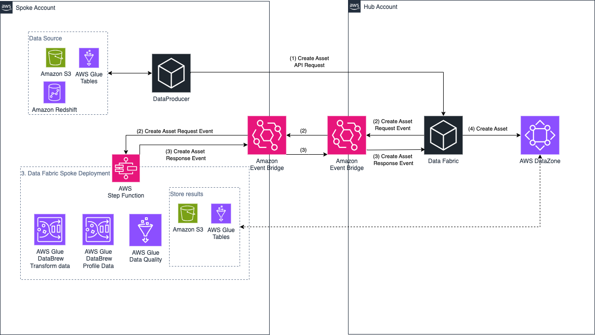
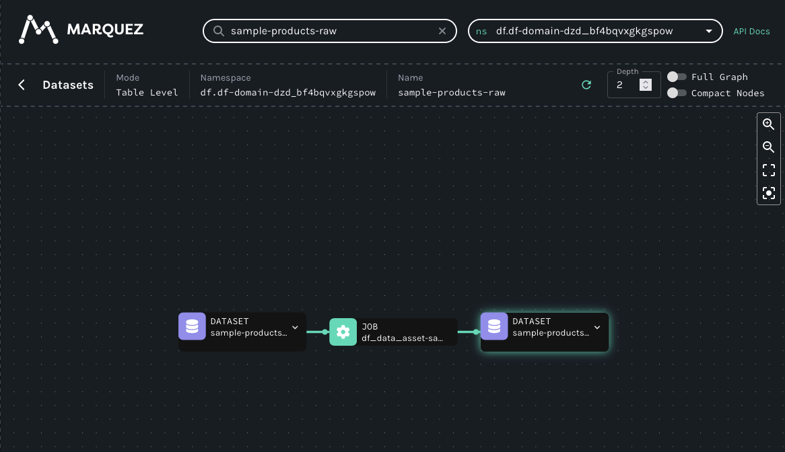
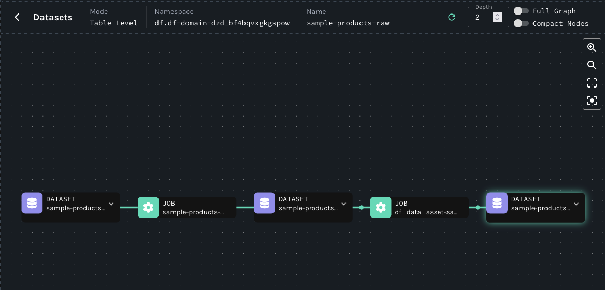

# Authoring a Data Product in Data Fabric on AWS

This guide will walk through how to author a data product in the data fabric.

## Prerequisites
* Data Fabric deployment has been completed, for additional documentation refer to [here](https://github.com/aws-solutions-library-samples/guidance-for-data-fabric-on-aws)
* And IAM Identity Center user has been created for your producer application and is a member of the Amazon DataZone project and has an Owner role please refer to [here](https://docs.aws.amazon.com/datazone/latest/userguide/add-members-to-project.html) for further details 

## Overview
Below is an architecture overview of creating a data asset as a data producer.



## Source Data
A simple sample dataset file can be found [in docs/sample_data/sample_products.csv](../../sample_data/sample_products.csv). Below are a few sample rows:

| sku     | units | weight | cost    |
| ------- | ------| ------ | ------- |
| Alpha   | 104   | 8      | 846.00  |
| Bravo   | 102   | 5      | 961.00  |
| Charlie | 155   | 4      | 472.00  |

These rows represent a table of imaginary product names, the number of units in inventory, their weight, and their cost.

## Data Producer using Data Fabric Create Asset API

### 1. Data Producer

For this example, let's imagine this CSV file was exported from our products database. We are then going to take this export and register it as a data product in the data fabric. As part of the registration process the data fabric API will add lineage showing the origin of the data as a CSV file. We will then add to this lineage to show this file was created as an export from our database.


#### 1.1. Registering the asset in DF

We have two methods to register a data asset in the Data Fabric :
* Via API call `POST /dataAssetTask` refer to the [swagger documentation](https://github.com/aws-solutions-library-samples/guidance-for-data-fabric-on-aws/blob/main/typescript/packages/apps/dataAsset/docs/swagger.json) for further details. The API call can be used by any UI to interact with the data fabric
* Via Event Bridge events

For this tutorial we will call the `data asset` API. Below is the body of the request.

**_Note:_** the `catalog` and `workflow` sections of the payload follow the format specified in the [swagger documentation](https://github.com/aws-solutions-library-samples/guidance-for-data-fabric-on-aws/blob/main/typescript/packages/apps/dataAsset/docs/swagger.json).
```
{
    "catalog": {
        "domainId": "<DATAZONE_DOMAIN_ID>",
        "domainName": "<DATAZONE_DOMAIN_NAME>",
        "environmentId": "<DATAZONE_ENVIRONMENT_ID>",
        "projectId": "<DATAZONE_PROJECT_ID>",
        "region": "<REGION>",
        "assetName": "sample-products-raw",
        "accountId": "<SPOKE_ACCOUNT_ID>",
        "autoPublish": true,
        "revision": 1
    },
    "workflow": {
        "name": "sample-products-raw-workflow",
        "roleArn": "<SERVICE_ROLE_ARN>",
        "dataset": {
            "name": "sample-products-raw-dataset",
            "format": "csv",
            "connection": {
                "dataLake": {
                    "s3": {
                        "path": "s3://<S3 PATH>/sample_products.csv",
                        "region": "<REGION>"
                    }
                }
            }
        }
    }
}
```
### 2. Data Fabric (Hub Account)

The data fabric application deployed in the hub account, is responsible for the orchestrator of all the various requests received from different accounts. It will then enrich the request and send event to the appropriate account where the DF spoke deployment will process the data based on the configuration provided.

**_Note:_** the targeted spoke account must have the spoke stack deployed within it so that events can be transferred between hub and spoke.

### 3. Data Fabric (Spoke Account)

The data fabric application within the spoke account will process the requests it receives from the hub account and perform a number of tasks, depending on the configuration provided
1. Transform the data based on the recipe formula provided using Glue Data Brew
2. Profile the data using Glue Data Brew
3. Perform Quality checks using Glue Data Quality
4. Store the final results in an S3 bucket and glue table ready to be discovered by DataZone
5. Construct the data Lineage for our data 
6. Finally published a completion event back to the spoke account to complete the creation of the asset in DataZone

### 4. Asset Creation (Hub Account)
Once the DF deployment within the hub account receives the completion event, it will create the asset within DataZone.
1. DF will create and run a DataZone DataSource with the appropriate metadata forms 
2. Once The DataSource run is complete DataZone creates an asset
3. DF updates the data lineage with the asset id and publishes it to Marquez

You can view the DataZone asset from your DataZone portal by navigating to your project.
You can view the lineage information from the Marquez portal or the Marquez API. the location of these endpoints can be grabbed from the following SSM parameters `/df/dataLineage/openLineageApiUrl` and `/df/dataLineage/openLineageWebUrl`.

In this image you can see what the lineage of our processed `sample_products_raw` looks like:


### 5. Adding Data Lineage

Now we want to add the lineage to show the full story of our data. This will include the products database and the export job to create the CSV file we registered in the data fabric. This is done by publishing an event to the data fabric event bus with the following format:
    * `eventBus`: `<DF Hub Event Bus Arn>`
    * `detail-type`: `DF>com.aws.df.hub.dataLineage>ingestion>request`
    * `source`: `com.aws.df.hub.dataLineage`

Below is an example EventBridge event to add an export job with the input as a product database and the CSV file as the output.

```
{
  "version": "0",
  "id": "5092dd1d-4e96-1695-1f2d-e647d2d7ce85",
  "detail-type": "DF>com.aws.df.hub.dataLineage>ingestion>request",
  "source": "com.aws.df.hub.dataLineage",
  "account": "<SPOKE_ACCOUNT_ID>",
  "time": "2024-04-08T21:23:48Z",
  "region": "<REGION>",
  "resources": [],
  "detail": {
    "producer": "sample-products-database-export",
    "schemaURL": "https://openlineage.io/spec/1-0-5/OpenLineage.json#/definitions/RunEvent",
    "job": {
      "namespace": "df.df-domain-<DATAZONE DOMAIN ID>",
      "name": "sample-products-database-export-job",
      "facets": {
        "documentation": {
          "_producer": "sample-products-database-export",
          "_schemaURL": "https://github.com/OpenLineage/OpenLineage/blob/main/spec/facets/DocumentationJobFacet.json",
          "description": "Producer of the sample products CSV file"
        },
        "ownership": {
          "_producer": "sample-products-database-export",
          "_schemaURL": "https://openlineage.io/spec/facets/1-0-0/OwnershipJobFacet.json",
          "owners": [
            {
              "name": "application:SampleProductsDatabaseExporter"
            }
          ]
        }
      }
    },
    "inputs": [
      {
        "namespace": "df.df-domain-<DATAZONE DOMAIN ID>",
        "name": "sample-products-database",
        "inputFacets": {},
        "facets": {
          "storage": {
            "fileFormat": "db",
            "storageLayer": "postgres-production",
            "_producer": "sample-products-database-export",
            "_schemaURL": "https://openlineage.io/spec/facets/1-0-0/StorageDatasetFacet.json"
          }
        }
      }
    ],
    "outputs": [
      {
        "namespace": "df.df-domain-<DATAZONE DOMAIN ID>",
        "name": "sample-products-raw-dataset",
        "outputFacets": {},
        "facets": {
          "lifecycleStateChange": {
            "_producer": "sample-products-database-export-job",
            "_schemaURL": "https://openlineage.io/spec/facets/1-0-0/LifecycleStateChangeDatasetFacet.json",
            "lifecycleStateChange": "CREATE"
          },
          "ownership": {
            "_producer": "sample-products-database-export-job",
            "_schemaURL": "https://openlineage.io/spec/facets/1-0-0/OwnershipDatasetFacet.json",
            "owners": [
              {
                "name": "application:SampleProductsDatabaseExporter"
              }
            ]
          },
          "storage": {
            "fileFormat": "csv",
            "storageLayer": "dataLake",
            "_producer": "sample-products-database-export-job",
            "_schemaURL": "https://openlineage.io/spec/facets/1-0-0/StorageDatasetFacet.json"
          }
        }
      }
    ],
    "eventTime": "2024-04-08T20:47:29.559Z",
    "eventType": "COMPLETE",
    "run": {
      "runId": "sample-products-database-export-job:b6da865d-5412-23d6-0014-5858964fdacb",
      "facets": {
        "nominalTime": {
          "_producer": "sample-products-database-export-job",
          "_schemaURL": "https://openlineage.io/spec/facets/1-0-0/NominalTimeRunFacet.json",
          "nominalStartTime": "2024-03-08T20:47:29.559Z",
          "nominalEndTime": "2024-03-08T20:52:22.852Z"
        }
      }
    }
  }
}
```

When this is published the data lineage is updated to show the database and export job:




## Data Producer without Using DF API

It is possible to use the opinionated data fabric approach and create data assets without using the `data asset` API. This is done as follows:

1. Create your DataZone asset using the `DF_Profile_Form` metadata form for further instructions visit DataZone [User Guide](https://docs.aws.amazon.com/datazone/latest/userguide/create-data-asset-manually.html). Save the id of the newly created asset.
2. Construct your data lineage using the asset id you saved from the previous step. We support [OpenLineage Object Model](https://openlineage.io/docs/spec/object-model) for our Lineage.
3. Publish an event to the DF event bus in the Hub account that contains the lineage information. you will need the to set the following information for the event for the dataLineage module to pickup the event
    * `eventBus`: `<DF Hub Event Bus Arn>`
    * `detail-type`: `DF>com.aws.df.hub.dataLineage>ingestion>request`
    * `source`: `com.aws.df.hub.dataLineage`
